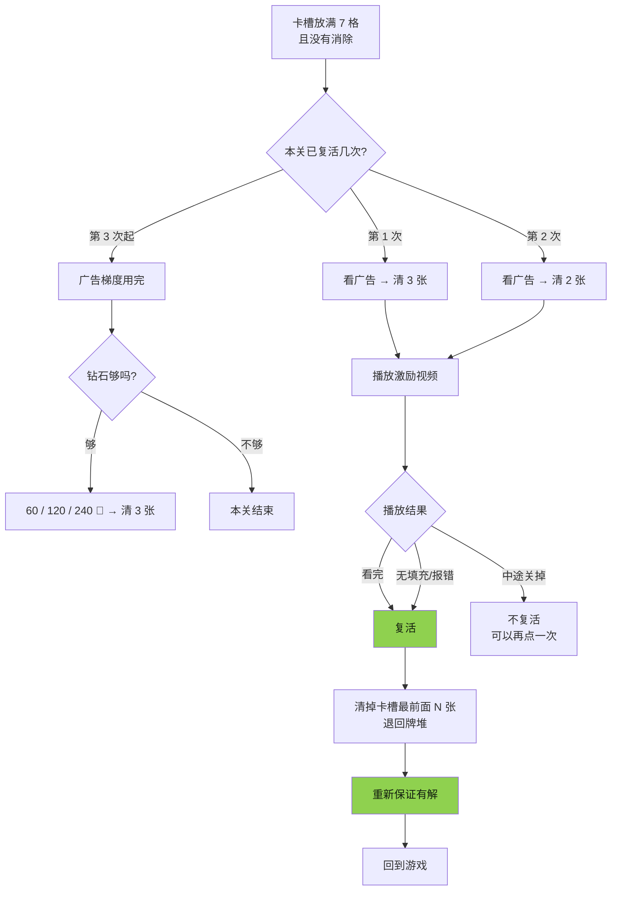
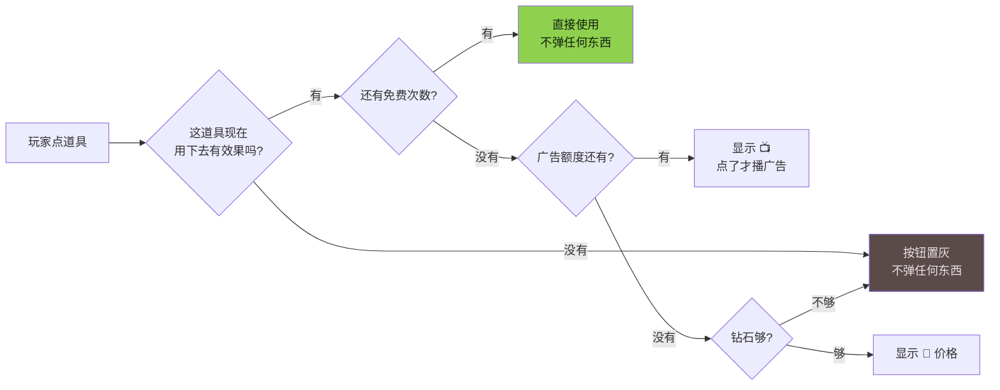

# 广告与变现设计

> 对应代码：`src/monetize/`（策略、闸门、复活、道具商店）
> 全部逻辑都有单测覆盖：`npm test`

## 一、三条原则

这三条不是口号，每一条都直接落成了代码里的配置项和断言。

### 原则 1：广告是玩家主动买的服务，不是我们强塞的税

绝大多数广告位是**激励视频**（玩家点了才播，且事先知道能换到什么）。
插屏只保留**一个**位置，带冷却和日上限。

> 为什么：小游戏的广告收入 = 日活 × 人均看广告次数 × eCPM。
> 强制广告能短期抬高第二项，但会同时压低第一项和留存，
> 三个月维度上几乎总是亏的。《羊了个羊》的口碑反噬就是例子。

### 原则 2：永远不要因为广告没加载出来而惩罚玩家

无填充、加载超时、网络抖动 —— 这些都不是玩家的错。

`grantOnFailure: true` 的广告位，**播放失败照样发奖励**。
丢的是一次 eCPM，保住的是留存，这笔账永远划算。

```ts
// src/monetize/ad-manager.ts
if (r.kind === 'error') {
  outcome = rule.grantOnFailure
    ? { granted: true, fallback: true, reason: 'ad-failed' }
    : { granted: false, reason: 'failed' };
}
```

注意 `fallback: true` 这个标记 —— 兜底发放的奖励**不能计入广告收入**，
否则对账会虚高，而且会掩盖填充率问题。

### 原则 3：前几分钟一分钱都不要赚

- 冷启动后 **180 秒**内不出任何广告（`coldStartQuietMs`）
- 前 **5 关**完全不出广告，连入口都不展示（`newUserQuietLevels`）

第一印象是「这游戏挺好玩」还是「广告真多」，直接决定次留，
而次留决定了这个用户一辈子能给你带来多少广告收入。

## 二、广告位全表

| 广告位 | 形式 | 玩家换到什么 | 日上限 | 单关上限 | 冷却 | 失败兜底 |
|---|---|---|---|---|---|---|
| `revive` | 激励视频 | 失败后继续游戏 | 12 | 2 | 0 | ✅ |
| `item_undo` | 激励视频 | 撤销 ×1 | 8 | 2 | 20s | ✅ |
| `item_pop3` | 激励视频 | 移出 ×1 | 8 | 2 | 20s | ✅ |
| `item_shuffle` | 激励视频 | 洗牌 ×1 | 8 | 2 | 20s | ✅ |
| `item_xray` | 激励视频 | 透视 ×1 | 8 | 2 | 20s | ✅ |
| `item_slot` | 激励视频 | 卡槽 +1 | 4 | 1 | 30s | ✅ |
| `item_box` | 激励视频 | **随机 3 个道具** | 6 | 1 | 60s | ✅ |
| `daily_double` | 激励视频 | 签到奖励 ×2 | 1 | – | 0 | ✅ |
| `offline_double` | 激励视频 | 牧场离线收益 ×2 | 3 | – | 0 | ✅ |
| `level_start` | **插屏** | （无，强制） | 5 | 1 | 240s | ❌ |
| `settle_banner` | Banner | （无） | – | – | – | ❌ |

全局约束：

- 任意两次广告之间最小间隔 **45 秒**（`revive` 豁免，理由见下）
- 激励视频每日总上限 **20 次**
- 插屏每日总上限 **5 次**

### 为什么 `revive` 豁免全局间隔

玩家刚刚失败，这一刻是全局付费意愿最高的时刻。
因为「45 秒前刚看过一个道具广告」就拒绝给他复活机会，
既损失收入，也让玩家莫名其妙。

```ts
if (placement !== 'revive' && now - this.lastAnyAdAt < globalMinIntervalMs) {
  return { allowed: false, reason: 'global-interval' };
}
```

## 三、失败后看广告继续（核心流程）



### 三个关键设计

**① 递减补偿：3 张 → 2 张 → 只能花钻石**

```ts
export const AD_REVIVE_LADDER = [3, 2];
```

如果每次都清一样多，玩家就能靠无限看广告硬拖过任何关卡。
后果是关卡难度失去意义、通关不再有成就感 —— **长期反而没人看广告了**。
递减让「广告复活」是一次救援，而不是一条捷径。

**② 复活后重新保证有解**

```ts
revive(clearTiles: number): boolean {
  this.status = 'playing';
  this.popBack(clearTiles);
  if (this.reguaranteeAfterRevive) this.reguarantee();  // ← 关键
  return true;
}
```

玩家花 30 秒看完广告，换来的必须是一个**真能打通**的局面。
如果复活回去发现还是死局，这 30 秒就变成了纯粹的欺骗感 ——
这是最伤留存的单点体验，也是《羊了个羊》挨骂最多的地方。

**③ 广告位被频控挡住时降级，而不是直接结束**

日上限到了 → 自动降级到钻石选项，而不是「本关结束」。
永远给玩家一条路。

### 相关单测

```
✓ 广告复活按梯度递减，用完后转钻石
✓ 复活之后的局面重新保证有解
✓ 广告无填充也能复活（玩家不为填充率买单）
✓ 复活位豁免全局间隔，道具位不豁免
```

## 四、道具需要看广告

### 交互顺序（很重要）



**先给甜头，再在断供点收广告。**

很多小游戏是「点道具就先弹广告确认框」，这会让玩家觉得每个按钮都是陷阱，
于是干脆不点道具了 —— 道具用得越少，广告收入反而越低。

我们的做法：前 5 关道具管够（`freeItems` 给到 3~5 次），
把使用习惯养出来；之后每关每种道具免费 1 次，用完才转广告。

### 绝不为无效道具播广告

```ts
async useByAd(game, kind) {
  // 先确认这道具真能起作用，再去播广告。顺序不能反。
  if (!game.canUseItem(kind)) return { ok: false, reason: 'no-effect' };
  ...
}
```

卡槽是空的还点「移出」、一步没走就点「撤销」—— 这些情况按钮直接置灰。
这个 bug 在开发过程中被单测抓到过一次：`buttonState` 当时返回 `ad`，
玩家看完广告，道具点下去什么都没发生。

### 道具箱：更优的形态

一次广告开 **3 个**随机道具，日上限 6 次，冷却 60 秒，放在关卡开始前的准备页。

单次广告的价值更高 → 玩家更愿意点 → **总的广告打断次数反而更少**。
对留存和 eCPM 都更友好，建议作为主推形态，单道具广告作为局内应急补充。

### 相关单测

```
✓ 有免费次数时不弹广告，用完才转广告
✓ 道具用下去没效果时直接置灰，不放行到广告
✓ 广告额度耗尽且钻石不足时道具置灰
✓ 钻石够时降级到钻石购买而不是置灰
✓ 单关上限生效：同一道具每关最多看 2 次广告
✓ 道具箱一次广告开出 3 个道具
```

## 五、频控矩阵

`AdManager.check()` 按顺序检查，任何一条不过就返回具体原因：

| 检查 | 拒绝原因 | 说明 |
|---|---|---|
| 该位是否启用 | `disabled` | `dailyCap: 0` 即关闭该位 |
| 冷启动静默期 | `cold-start-quiet` | 前 180 秒 |
| 新手关 | `newbie-levels` | 前 5 关 |
| 该位日上限 | `daily-cap` | 见广告位全表 |
| 该形式日总上限 | `format-daily-cap` | 激励 20 / 插屏 5 |
| 单关上限 | `level-cap` | `startLevel()` 时重置 |
| 该位冷却 | `placement-cooldown` | 见广告位全表 |
| 全局最小间隔 | `global-interval` | 45 秒，`revive` 豁免 |

拒绝原因会透传给 UI，用来决定按钮是**置灰**还是**降级到钻石**还是**隐藏**。

跨自然日自动重置（`dayKey()` 按 ISO 日期），状态持久化在平台 storage 里，
杀进程重进不会绕过上限。

> 记账在播放**之前**完成。哪怕播放过程中抛异常，频控也不会失效 ——
> 否则一个必现的播放崩溃就能让玩家无限刷广告位。

## 六、收入模型（估算框架）

不给具体预测数字（严重依赖买量成本、留存、当期 eCPM），
但给出应该怎么算：

```
ARPDAU = 人均激励视频次数 × 激励 eCPM / 1000
       + 人均插屏次数     × 插屏 eCPM / 1000
       + 人均 banner 曝光 × banner eCPM / 1000
       + 内购 ARPDAU
```

按当前策略，一个中度玩家单日的合理区间：

| 来源 | 次数/DAU | 说明 |
|---|---|---|
| 复活激励 | 2 ~ 5 | 主力，取决于难度曲线 |
| 道具/道具箱 | 1 ~ 3 | 尖峰关附近显著上升 |
| 签到/离线翻倍 | 1 ~ 2 | 接受度最高，几乎无损体验 |
| 插屏 | 0 ~ 2 | 严格受 240 秒冷却限制 |

**上限被 `rewardedDailyCap: 20` 硬性封住。**
这不是保守，是刻意的：超过这个量级的用户基本处在「被广告淹没」的状态，
第二天不会回来。

## 七、怎么调（上线后）

1. **所有数值走远端配置下发**，不要硬编码进包体。
   `DEFAULT_AD_POLICY` 只是冷启动兜底。
2. **分层 AB**，一次只动一个旋钮。优先测：
   - `newUserQuietLevels`（3 / 5 / 8）
   - `AD_REVIVE_LADDER`（`[3,2]` / `[3,2,1]` / `[4,2]`）
   - 道具箱 vs 单道具作为主推
3. **看的指标不是当日 ARPDAU，而是 7 日累计 LTV。**
   几乎所有加广告的改动都能抬高当日 ARPDAU，
   只有一部分能抬高 7 日 LTV，剩下的都是在借明天的钱。
4. **必看的护栏指标**：次留、第 2~5 关流失率、单用户日均广告次数分布的 P90。
   P90 异常说明有一小撮用户被反复轰炸。

## 八、埋点

`AdManager` 的 `onEvent` 回调吐出完整漏斗：

```ts
{ placement, at, blocked?: BlockReason, outcome?: AdOutcome }
```

至少要能算出这几个数：

- **请求 → 展示成功率**（填充率健康度）
- **展示 → 看完率**（素材质量 / 是否有误触）
- **兜底发放占比**（`fallback: true` 的比例；持续 >5% 说明填充有问题）
- **各 `BlockReason` 的分布**（哪条频控在实际起作用，是不是卡太死）

最后一条经常被忽略，但很有用：如果 `global-interval` 占了拒绝量的 80%，
说明 45 秒可能定得太保守，可以试着降到 30 秒。

## 九、合规红线

- 激励视频**必须**明确告知奖励内容，播放前有确认，不能自动播
- 不能诱导分享（抖音和微信都明令禁止），
  分享入口要做成「可选的额外奖励」而不是「不分享就不给玩」
- 未成年人保护：按平台要求接入防沉迷，未成年账号应显著降低广告频次
- 广告加载失败不能卡死流程 —— 这既是体验问题，也是审核会查的点
- 具体规则以抖音开放平台**当期**审核规范为准，上线前逐条对一遍

---

上一篇：[游戏设计 · 叠羊记](./02-游戏设计-叠羊记.md) ·
下一篇：[抖音小游戏接入](./04-抖音小游戏接入.md)
